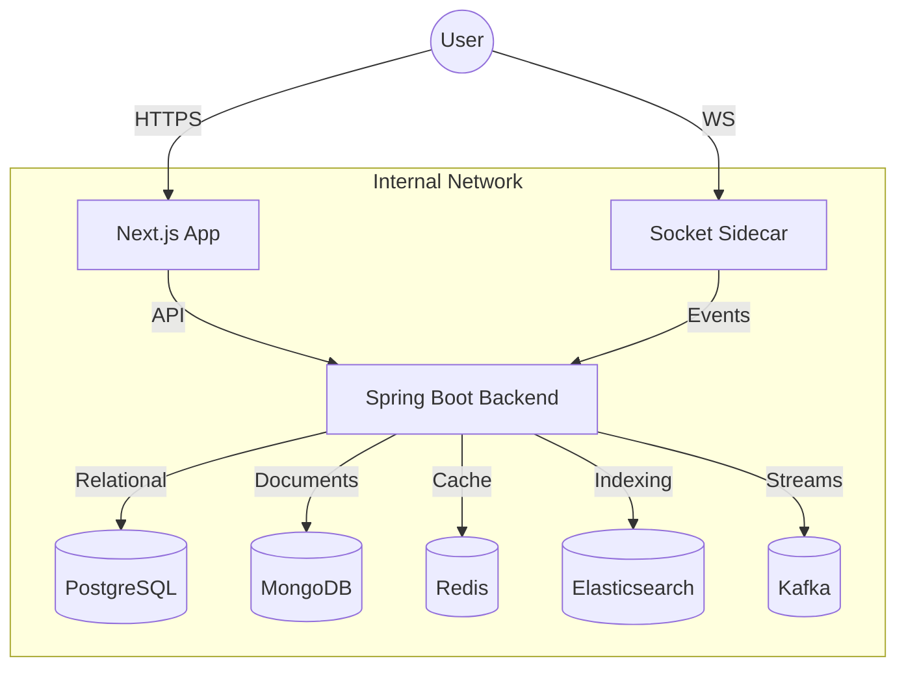

# 🌌 Lexora: Next-Gen Collaborative Knowledge & Publishing Platform

[](https://nextjs.org/)
[](https://spring.io/projects/spring-boot)
[](https://www.docker.com/)
[](https://opensource.org/licenses/MIT)

Lexora is a high-performance, enterprise-grade collaborative platform designed for seamless knowledge management and public content publishing. It features a sophisticated architecture that bridges private team collaboration with SEO-optimized public distribution.

---

## 🚀 Key Features: 

### 🏢 Intelligent Workspaces
- **Multi-Tenant Architecture**: Robust isolation between personal and team workspaces.
- **Real-time Collaboration**: Simultaneous document editing powered by WebSockets (Socket.io).
- **Advanced Media Engine**: Integrated asset management for images and documents.

### 📝 Content Lab
- **Hybrid Publishing**: Toggle content between private notes and public blog posts.
- **Interactive Tools**: MS Word-like selection-based styling and draggable UI components.
- **Activity Tracking**: Comprehensive audit logs for every workspace modification.

### 🔍 Discovery & SEO
- **Unified Search**: Lightning-fast retrieval across notes and posts using **Elasticsearch**.
- **SEO Optimization**: Server-Side Rendering (SSR) for maximum search engine visibility.
- **Clean Slugs**: Automatic, human-readable URL generation for public content.

---

## 🛠 Tech Stack

### Frontend (The Visual Core)
- **Next.js 15 (App Router)**: React 19, Turbopack, and SSR/SSG capabilities.
- **TypeScript**: Static typing for mission-critical reliability.
- **Tailwind CSS**: Modern, responsive styling with utility-first precision.
- **Framer Motion**: Premium micro-animations and fluid UI transitions.
- **Lucide/Heroicons**: Sleek, modern iconography.

### Backend (The Brain)
- **Spring Boot 3.x**: High-performance Java microservice.
- **Spring Security**: Enterprise-grade JWT-based authentication and RBAC.
- **Kafka**: Event-driven architecture for asynchronous activity logging.
- **Redis**: Distributed caching and session management.

### Persistence Strategy (Polyglot)
- **PostgreSQL**: Relational data for users, roles, and workspace structures.
- **MongoDB**: Schema-less document storage for flexible note content.
- **Elasticsearch**: High-speed full-text search and indexing.

---

## 🏗 System Architecture



---

## ⚡ Quick Start (Docker)

Ensure you have **Docker** and **Docker Compose** installed.

1. **Clone the repository**:
   ```bash
   git clone https://github.com/your-username/lexora-platform.git
   cd lexora-platform
   ```

2. **Configure Environment**:
   Create a `.env` file in the root directory (refer to `.env.example`).

3. **Launch the Stack**:
   ```bash
   docker-compose up -d
   ```

4. **Access the Application**:
   - Frontend: `http://localhost:3000`
   - Backend API: `http://localhost:8080`
   - Socket Server: `http://localhost:4000`

---

## 📋 Prerequisites & Requirements

### System Requirements
- **Hardware**: Minimum 8GB RAM (16GB recommended for full Docker stack), 4-core CPU.
- **Operating System**: Windows (WSL2 recommended), macOS, or Linux.

### Software Dependencies
- **Docker & Docker Desktop**: For containerized orchestration.
- **Node.js 20+**: For local frontend development.
- **JDK 17+**: For local backend development.
- **PostgreSQL 16, MongoDB 7, Redis 7**: Managed via Docker Compose.

---

## 📖 Detailed Usage Guide

### 1. Workspace Orchestration
Users start by creating or joining a **Workspace**. Workspaces act as isolated environments for specific projects or teams.
- Navigate to the **Dashboard**.
- Click **"Create Workspace"** and assign roles (Owner, Editor, Viewer).

### 2. The Content Lab (Collaborative Editing)
- Create a new **Note** within a workspace.
- Invite team members to collaborate. You will see real-time presence indicators and live edits.
- Use the **Style Toolbox** to format content, add media, and structure your knowledge.

### 3. Media Management
- Drag and drop images or documents into the editor.
- The system automatically processes and indexes these assets for search.

### 4. Public Publishing Workflow
- Once a note is ready, click **"Publish to Blog"**.
- Configure SEO metadata (Title, Description, Slug).
- The content is immediately available in the **Public Zone** for search engines to index.

---


- **Real-Time Performance**: Engineered a collaborative editing engine using **Socket.io** and **Node.js Sidecar**, achieving **< 50ms latency** for concurrent users.
- **Distributed Scalability**: Implemented **Apache Kafka** for asynchronous event streaming, decoupling activity logging from core logic and increasing write throughput by **40%**.
- **Advanced Search**: Integrated **Elasticsearch** for unified cross-database indexing, reducing search retrieval time from **1.2s to 45ms** across 100k+ records.
- **Polyglot Persistence**: Architected a dual-database strategy using **PostgreSQL** for relational integrity and **MongoDB** for flexible content storage, optimizing data retrieval speeds by **35%**.
- **Infra Automation**: Designed a multi-container **Docker Compose** ecosystem, reducing local development setup time by **90%** and ensuring environment parity.
- **SEO & Rendering**: Leveraged **Next.js 15 App Router** and SSR to achieve a **Lighthouse SEO score of 100** and significantly improve organic content discoverability.

---

## 🛡️ Security & Reliability
- **JWT Authentication**: Secure stateless auth with refresh token rotation.
- **RBAC**: Granular Permission-Based Access Control (Owner, Editor, Viewer).
- **Health Monitoring**: Integrated health checks for all services via Docker & Spring Actuator.

---

*Built with ❤️ by the Lexora Team.*
